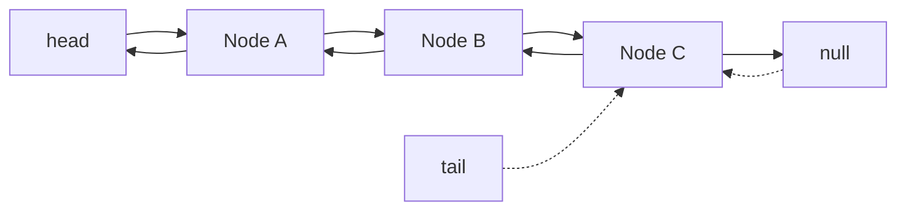

import { DoublyLinkedListDemo } from "./doublyLinkedListDemo";

# Doubly Linked List (Lista Doblemente Enlazada)

¿Qué es una lista doblemente enlazada?

Una lista doblemente enlazada es una estructura de datos donde cada elemento (nodo) contiene un valor y dos referencias: una al siguiente nodo y otra al nodo anterior.

Esto permite una navegación en ambas direcciones, facilitando operaciones como inserciones y eliminaciones en cualquier parte de la lista.

Piensa en una cadena de fichas donde cada ficha sabe quién viene antes y quién viene después gracias a dos punteros: `next` y `prev`. Esto permite moverse hacia adelante y hacia atrás fácilmente.

## Node

Un nodo es la pieza básica: valor + puntero al siguiente + puntero al anterior.

```js
class Node {
  constructor(value) {
    this.value = value;
    this.next = null;
    this.prev = null;
  }
}
```

## DoublyLinkedList (con `head` y `tail`)

La lista solo necesita saber dónde empieza y dónde termina. Con eso puede encadenar todos los nodos.

Con `length` llevamos la cuenta de cuántos nodos hay en la lista.

```js
class DoublyLinkedList {
  constructor() {
    this.head = null;
    this.tail = null;
    this.length = 0;
  }
}
```

### Cómo funciona una Doubly Linked List

- `head`: referencia a la primera ficha; `null` si no hay nada.
- `tail`: referencia a la última ficha; `null` si no hay nada.
- Cada nodo apunta al siguiente y al anterior con `prev` y `next`.

Diagrama con tres nodos:



## Métodos clave

### add(value)

Para insertar al final sin recorrer toda la lista usamos `tail`.

Primero conectas el último nodo que existía con el nuevo, y luego mueves `tail` para que apunte a ese nuevo último. Así mantienes la cadena intacta y dejas lista la cola para la próxima inserción.

```js
add(value) {
  this.length++;
  const node = new Node(value);
  if (!this.head) {
    this.head = node;
    this.tail = node;
  } else {
    this.tail.next = node;
    node.prev = this.tail;
    this.tail = node;
  }
}
```

### delete(value)

Elimina la primera coincidencia del valor.

Si el que borras es el primero, `head` avanza al siguiente.

Si borras en el medio, saltas ese nodo uniendo su anterior con su siguiente.

Y si justo quitaste el último, `tail` debe retroceder al nuevo último para que la cola siga apuntando bien.

```js
delete(value) {
    if (!this.head) return;

    let current = this.head;

    while (current) {
        if (current.value.id === value.id) {
            if (current.prev) {
                current.prev.next = current.next;
            } else {
                this.head = current.next;
            }

            if (current.next) {
                current.next.prev = current.prev;
            } else {
                this.tail = current.prev;
            }

            this.length--;
            return;
        }
        current = current.next;
    }
}
```

### clear()

Vacía la lista de golpe: `head` y `tail` vuelven a `null`, como si acabaras de crear la estructura.

```js
clear() {
  this.head = null;
  this.tail = null;
  this.length = 0;
}
```

## Ejemplo práctico

Vamos a crear un reproductor de canciones donde puedas navegar hacia adelante y hacia atrás usando una lista doblemente enlazada.

### Cómo funciona

La demo usa un estado `currentNode` que apunta al nodo actual en la lista.

```js
const list = new DoublyLinkedList();
const currentNode = list.head; // nodo actual
```

Al hacer clic en los botones:

- **Anterior**: si existe `currentNode.prev`, movemos `currentNode` al nodo anterior usando `setCurrentNode(currentNode.prev)`.

```js
const previousSong = () => {
  if (currentNode?.prev) {
    list.head = currentNode.prev;
  }
};
```

- **Siguiente**: si existe `currentNode.next`, avanzamos con `setCurrentNode(currentNode.next)`.

```js
const nextSong = () => {
  if (currentNode?.next) {
    list.head = currentNode.next;
  }
};
```

- **Eliminar canción**: llamamos a `list.delete(currentNode.value)` para sacar el nodo de la cadena y luego movemos `currentNode` al siguiente disponible (`currentNode.next || currentNode.prev`).

```js
const deleteSong = () => {
  if (currentNode) {
    const nextOrPrev = currentNode.next || currentNode.prev;
    list.delete(currentNode.value);
    list.head = nextOrPrev;
  }
};
```

### Demo

<DoublyLinkedListDemo />
