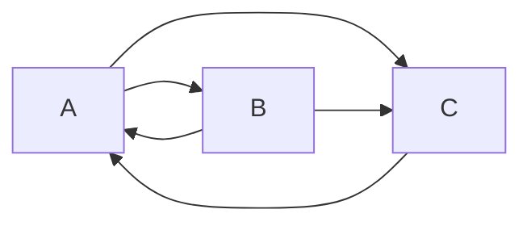
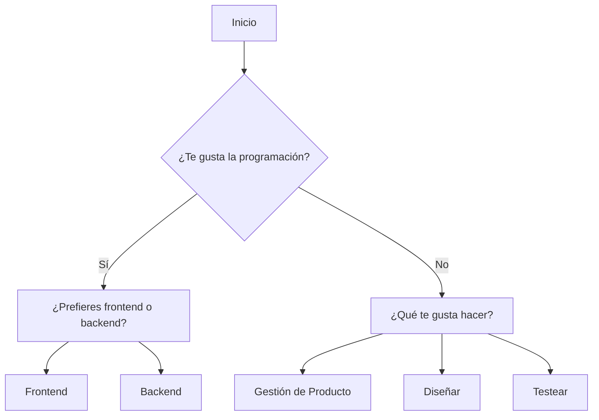

import { GraphDemo } from "./graphDemo";

# Graph (Grafo)

¿Qué es un grafo?

Un grafo es una estructura de datos que consiste en un conjunto de nodos (o vértices) y un conjunto de aristas (o conexiones) que unen nodos entre sí.

## Node

Un nodo es la unidad básica del grafo, que contiene un valor y una lista de nodos a los que está conectado.

```js
class Node {
  constructor(value) {
    this.value = value;
    this.edges = [];
  }
}
```

## Métodos para Node

### addEdge(node)

Agrega una conexión (arista) a otro nodo.

```js
addEdge(node) {
  this.edges.push(node);
}
```

## Graph

Un grafo mantiene una lista de todos los nodos y tiene métodos para agregar nodos y aristas.

En este caso, `nodes` será un `Map` para facilitar la búsqueda de nodos por su valor, pero también podría ser un array.

```js
class Graph {
  constructor() {
    this.nodes = new Map();
  }
}
```

## Métodos para Graph

### addNode(value)

Agrega un nuevo nodo al grafo.

```js
addNode(value) {
  const newNode = new Node(value);
  this.nodes.set(value, newNode);
  return newNode;
}
```

### addEdge(startedValueNode, endedValueNode)

Agrega una arista entre dos nodos existentes.

```js
addEdge(startedValueNode, endedValueNode) {
  const startNode = this.nodes.get(startedValueNode);
  const endNode = this.nodes.get(endedValueNode);
  if (startNode && endNode) {
    startNode.addEdge(endNode);
  }
}
```

## Ejemplo práctico

Vamos a crear un grafo simple con tres nodos y algunas conexiones entre ellos.

```js
const graph = new Graph();
const nodeA = graph.addNode("A");
const nodeB = graph.addNode("B");
const nodeC = graph.addNode("C");
graph.addEdge("A", "B");
graph.addEdge("A", "C");
graph.addEdge("B", "C");
graph.addEdge("B", "A");
graph.addEdge("C", "A");
```

Aquí hemos creado un grafo con tres nodos (A, B, C) y cinco aristas que conectan estos nodos entre sí.

Visualmente, el grafo se vería así:



¿Cómo puede funcionar esto en frontend?

Por ejemplo, podemos crear secciones que se vayan representando condicionalmente según las respuestas del usuario, y cada sección puede estar conectada a otras secciones dependiendo de las respuestas previas.

Veamos un diagrama de flujo simple que puede representar un cuestionario interactivo:



<br />

Añadimos un componente interactivo que utiliza un grafo para navegar entre diferentes secciones basadas en las respuestas del usuario.

He tenido que modificar un poco la clase `Node` para añadir el componente; realmente solo he añadido el campo `component`. En la mayoría de los casos, se tendrá que adaptar la clase `Node` a las necesidades de cada implementación.

También se podría haber creado una propiedad `nodeValue` que tuviera el id y el componente en un objeto, pero en este caso he preferido mantener el id separado para facilitar la gestión de las conexiones entre nodos.

```ts
export class Node {
  id: NodeId;
  component: SectionComponent;
  edges: Set<NodeId>;

  constructor(id: NodeId, component: SectionComponent) {
    this.id = id;
    this.component = component;
    this.edges = new Set();
  }

  addEdge(toId: NodeId) {
    this.edges.add(toId);
  }
}
```

El primer paso consiste en instanciar el grafo con las secciones y sus conexiones.

```js
const graph = new Graph();

graph.addNode(START, InitSection);
graph.addNode(PROGRAMMING, ProgrammingSection);
graph.addNode(BACKEND_OR_FRONTEND, BackendOrFrontendSection);
graph.addNode(WHAT_DO_YOU_LIKE, WhatDoYouLikeSection);
graph.addNode(FINISHED, FinishedSection);

graph.addEdge(START, PROGRAMMING);
graph.addEdge(PROGRAMMING, BACKEND_OR_FRONTEND);
graph.addEdge(PROGRAMMING, WHAT_DO_YOU_LIKE);
graph.addEdge(BACKEND_OR_FRONTEND, FINISHED);
graph.addEdge(WHAT_DO_YOU_LIKE, FINISHED);

return graph;
```

Utilizaremos un estado para manejar la sección actual y renderizar el componente correspondiente.

```ts
const [currentSection, setCurrentSection] = useState<GraphNode>(
  graph.nodes.get(START)
);
```

Y en cada botón de la sección, actualizaremos el estado para navegar a la siguiente sección según la respuesta del usuario.

```js
<RadioButton
    id={PROGRAMMING_YES_ID}
    name={"question"}
    value={PROGRAMMING_YES_ID}
    label={"Sí"}
    checked={selected === PROGRAMMING_YES_ID}
    onChange={(event) => setSelected(event.target.value)}
/>
<RadioButton
    id={PROGRAMMING_NO_ID}
    name={"question"}
    value={PROGRAMMING_NO_ID}
    label={"No"}
    checked={selected === PROGRAMMING_NO_ID}
    onChange={(event) => setSelected(event.target.value)}
/>
<Button
  label={"Siguiente"}
  onClick={() =>
    setCurrentSection(
      graph.getNode(
        selected === PROGRAMMING_YES_ID
          ? SECTIONS_IDS.BACKEND_OR_FRONTEND
          : SECTIONS_IDS.WHAT_DO_YOU_LIKE
      )
    )
  }
/>
```

_En React necesitamos un estado para manejar la sección actual, pero se puede adaptar a cualquier framework o librería de frontend._

## Demo

<GraphDemo />
